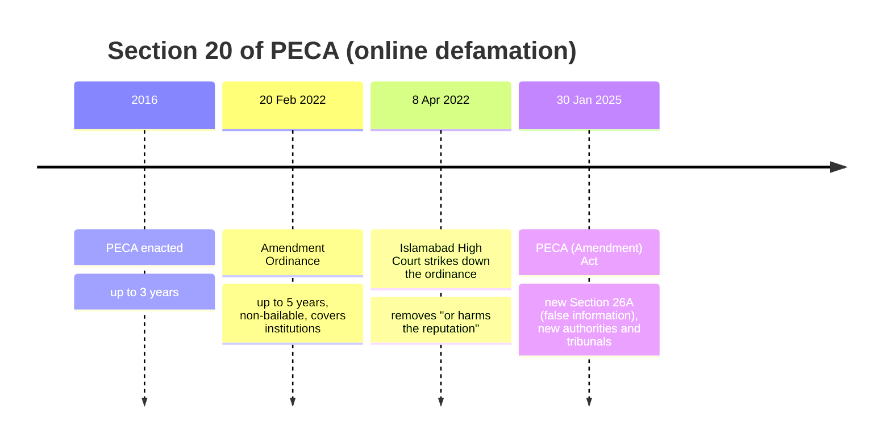
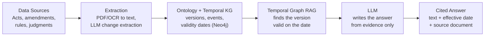
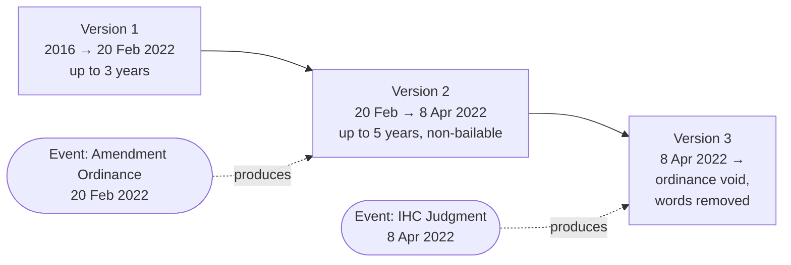
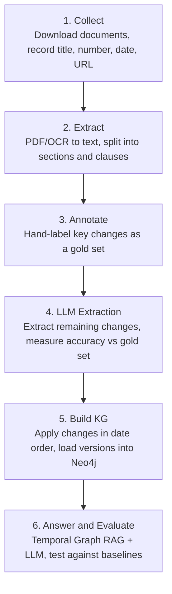

# Temporal Regulatory Knowledge Graph

**An Ontology + Temporal Knowledge Graph + LLM + RAG system that tracks how Pakistan's cyber laws change over time, and answers legal questions using the version of the law that was valid on a given date.**

> BS Computer Science Final Year Project, University of Sargodha
> Status: Phase 1 (Planning and Research)

---

## Table of Contents

- [The Idea in One Paragraph](#the-idea-in-one-paragraph)
- [Background](#background)
- [Problem Statement](#problem-statement)
- [Why This Project Matters](#why-this-project-matters)
- [Research Gap and Uniqueness](#research-gap-and-uniqueness)
- [Research Question and Objectives](#research-question-and-objectives)
- [System Overview](#system-overview)
- [Core Components](#core-components)
- [Worked Example](#worked-example)
- [Dataset](#dataset)
- [Pipeline](#pipeline)
- [Evaluation Plan](#evaluation-plan)
- [Planned Tech Stack](#planned-tech-stack)
- [Expected Outcomes](#expected-outcomes)
- [Timeline](#timeline)
- [Repository Structure](#repository-structure)
- [Literature Review](#literature-review)
- [Team](#team)
- [Disclaimer](#disclaimer)

---

## The Idea in One Paragraph

Laws are not fixed documents. A law is passed, then amended, then supplemented by rules, and sometimes parts of it are struck down by courts. To know which rule applied on a particular date, a person has to read many documents together in the right order. This project builds a system that does this automatically. It stores every version of every section of the law in a **temporal knowledge graph**, records **what changed, when, and by which document**, and lets users ask questions in plain language. An **LLM** writes the answer using only evidence retrieved from the graph, cites its sources, and says *"I don't know"* when there is no evidence.

---

## Background

Pakistan's cyber law is not a single document. It is a network of laws, rules, authorities and court rulings:

| Type | Examples |
|------|----------|
| Primary laws | Prevention of Electronic Crimes Act (PECA) 2016, Electronic Transactions Ordinance 2002, Pakistan Telecommunication (Re-organization) Act 1996 |
| Changes | PECA Amendment Ordinance 2022, PECA (Amendment) Act 2025 |
| Rules | Rules for removing and blocking unlawful online content made under PECA |
| Court rulings | Judgments that strike down or reinterpret sections |
| Authorities | PTA, FIA Cyber Crime Wing (now NCCIA), Social Media Protection and Regulatory Authority |

### The law keeps changing: Section 20 of PECA as an example



The same section had three different meanings within a few years. A search engine or chatbot cannot reliably tell you which one applied on a specific date.

---

## Problem Statement

It is difficult for citizens, lawyers, investigators and students to answer:

- Which version of a rule applied on a given date?
- What changed between the old and new version?
- When did the change become effective, and which document caused it?
- Which offences, requirements or authorities are affected by the change?

The reasons are:

1. **Scattered sources.** Acts, ordinances, amendments, rules and judgments are published separately, mostly as PDFs.
2. **No point-in-time versions.** Pakistan has no official system that shows a law "as it stood on" a past date.
3. **Court rulings change the law silently.** Printed copies of an Act often still show words that a court has struck down.
4. **AI chatbots give outdated answers.** General LLMs answer from memory, have no date awareness, and rarely cite sources.

---

## Why This Project Matters

In criminal law, the date matters: a person can only be charged under the law that was in force when the act happened. Getting the date wrong means getting the law wrong.

| Who | What they need |
|-----|----------------|
| Citizens and victims | Which offence and punishment applies |
| Journalists and social media users | How defamation and false-information rules have changed |
| Lawyers, judges and investigators | The exact provision valid on the date of an alleged offence |
| Students and researchers | A reliable, evidence-backed history of the law |

---

## Research Gap and Uniqueness

| Capability | Govt sites (Pakistan Code) | Legal databases | ChatGPT / general LLM | **This project** |
|------------|:---:|:---:|:---:|:---:|
| Law "as on" any past date | No | No | No | **Yes** |
| Links amendments and court rulings to sections | No | Manual search | No | **Yes** |
| Natural-language questions | No | Keyword only | Yes | **Yes** |
| Cites the exact source for each claim | – | – | Rarely | **Yes** |
| Says "I don't know" when unsupported | – | – | No | **Yes** |

**What makes this idea unique:**

1. **First of its kind for Pakistan.** We found no temporal legal knowledge graph for Pakistani law.
2. **Court rulings as change events.** A judgment that strikes down words is modelled as a change event, just like an amendment.
3. **Fully integrated system.** Ontology, knowledge graph, LLM and RAG work together. Most existing work uses only one or two of these.
4. **Date-aware, cited answers.** Every answer names the version, its validity dates, and the document that created it.
5. **New dataset.** A versioned, annotated dataset of Pakistan's cyber law that others can reuse.

---

## Research Question and Objectives

**Research question:** Can an integrated system of ontology, temporal knowledge graph, LLM and RAG answer questions about Pakistan's cyber law more accurately, with the correct version and fewer hallucinations, than a standalone LLM or plain RAG?

**Objectives:**

1. Collect and annotate PECA 2016, its amendments, rules and key court judgments into a versioned dataset.
2. Design a cyber-law ontology that reuses international standards (ELI, Akoma Ntoso).
3. Build a temporal knowledge graph where every provision has a validity period and a change history.
4. Detect amendments and analyse which offences, requirements or authorities are affected.
5. Build an LLM + RAG question-answering layer that cites evidence or abstains.
6. Evaluate the system against a standalone LLM and plain RAG.

---

## System Overview



| Layer | What it does |
|-------|--------------|
| 4. Interface | Web app: ask a question, pick a date, see the answer, source text and version timeline |
| 3. Intelligence | LLM question parser, Temporal Graph RAG retriever, LLM answer generator, citation checker |
| 2. Knowledge | Cyber-law ontology (schema), temporal KG in Neo4j, vector index of section texts |
| 1. Data | Source documents, PDF/OCR extraction, LLM change extraction, human-checked gold set |

---

## Core Components

The four components each have one job:

| Component | Role | In simple words |
|-----------|------|-----------------|
| **Ontology** | Defines what types of things and relationships can exist | The blueprint |
| **Knowledge Graph** | Stores the actual facts and every version over time | The memory |
| **RAG** | Finds the right version and its source text for each question | The librarian |
| **LLM** | Extracts changes from documents, understands questions, writes answers | The reader and writer |

### 1. Ontology

**Main classes**

| Class | Examples |
|-------|----------|
| Legal Document | Act, Ordinance, Rules |
| Provision | Section, Sub-section, Clause |
| Version | Text of a provision for a specific period |
| Change Event | Amendment, Court Judgment, Repeal |
| Offence and Punishment | Online defamation, up to 3 years |
| Authority | PTA, NCCIA, SMPRA, Courts |
| Requirement / Service | Obligations and services affected by a provision |

**Key relationships**

```
(Section)-[:HAS_VERSION]->(Version)
(Version)  { valid_from, valid_to }
(ChangeEvent)-[:PRODUCES]->(Version)
(ChangeEvent)-[:ENDS]->(Version)
(ChangeEvent)-[:ISSUED_BY]->(Authority)
(Section)-[:DEFINES]->(Offence)-[:PUNISHED_BY]->(Punishment)
(Section)-[:AFFECTS]->(Requirement)
```

The design reuses ideas from the **ELI** (European Legislation Identifier) and **Akoma Ntoso** standards, and the Work/Version model used in recent legal knowledge graph research.

### 2. Temporal Knowledge Graph

Every version of a section is a separate node with validity dates. Every change is linked to the event that caused it.



Finding the rule valid on a date `t` becomes a simple query:

```cypher
MATCH (s:Section {id: "PECA-20"})-[:HAS_VERSION]->(v:Version)
WHERE v.valid_from <= date($t)
  AND (v.valid_to IS NULL OR date($t) < v.valid_to)
RETURN v.text, v.valid_from, v.valid_to
```

### 3. LLM

The LLM is used only where it is strong, and always under the control of the graph:

| Job | When | What it does |
|-----|------|--------------|
| Extract changes | Build time | Reads amendment acts and judgments, outputs structured JSON (section, change type, old/new text, date). Accuracy is checked against a hand-labelled gold set. |
| Understand the question | Query time | Turns *"Was posting fake news a crime in 2023?"* into `offence = false information`, `date = 2023` |
| Write the answer | Answer time | Writes a clear answer using only retrieved evidence, with citations, or says it cannot answer |

### 4. Temporal Graph RAG

RAG means the LLM does not answer from memory. The system first retrieves trusted evidence, then the LLM answers from it.

1. **Graph query:** Cypher finds the version valid on the asked date.
2. **Text search:** vector search adds related clauses and rules.
3. **Build context:** text, dates, change history and source IDs.
4. **Generate:** the LLM answers from the context only, with citations.
5. **Check:** each claim is matched to evidence; unsupported claims are removed, or the system abstains.

**Why not plain RAG?** Plain RAG searches by text similarity. The old and new Section 20 look almost identical as text, so plain RAG may return both or the wrong one. Our graph filters by date first.

---

## Worked Example

**Question:** *"What was the punishment for online defamation in March 2022, and is it still the same?"*

1. **LLM parses:** online defamation → Section 20 PECA; dates = March 2022 and today.
2. **Graph returns:** Version 2 (valid 20 Feb – 8 Apr 2022) and Version 3 (current), with their events.
3. **Context built:** both texts, the 2022 Ordinance, and the IHC judgment of 8 April 2022.
4. **Answer:**

> In March 2022 the PECA Amendment Ordinance was in force: up to 5 years, non-bailable *[Ordinance, 20 Feb 2022]*. On 8 April 2022 the Islamabad High Court declared it unconstitutional and removed "or harms the reputation" from Section 20 *[IHC judgment]*. So it is no longer the same.

---

## Dataset

No ready-made dataset exists, so building one is part of the contribution. All sources are public and Pakistani.

| Source | What we take | Format |
|--------|--------------|--------|
| Pakistan Code (pakistancode.gov.pk) | Base text of PECA 2016, ETO 2002, PTA Act 1996 | HTML / PDF |
| National Assembly and Senate | Amendment Act 2025, bills, ordinances | PDF |
| Gazette of Pakistan | Official notifications and effective dates | PDF (some scanned) |
| PTA and Ministry of IT | Rules made under PECA, content-blocking rules | PDF |
| High Courts and Supreme Court | Judgments that strike down or interpret PECA sections | PDF |

**Planned size:** about 50–60 sections with their versions, change events and sources, a hand-checked gold set, and about 100 test questions.

> AI law and policy documents will be added to the scope as advised by the supervisors, once sources are finalised.

---

## Pipeline



---

## Evaluation Plan

**Three systems compared:**

| System | Description |
|--------|-------------|
| Baseline 1 | LLM alone (no retrieval) |
| Baseline 2 | LLM + plain text RAG |
| **Ours** | Ontology + Temporal KG + Graph RAG + LLM |

**Test set:** about 100 questions of three types:
- What did the law say on date X?
- What changed, when, and by which document?
- Is this provision still valid today?

**Metrics:**

| Metric | Measures |
|--------|----------|
| Answer correctness | Matches the gold answer |
| Version accuracy | Correct version used for the asked date |
| Citation accuracy | The cited source actually supports the claim |
| Hallucination rate | Unsupported claims, at claim level and answer level |
| Extraction F1 | LLM change extraction vs the gold set |

---

## Planned Tech Stack

| Area | Tools (planned) |
|------|-----------------|
| Language | Python |
| PDF and OCR | PyMuPDF, Tesseract OCR |
| Graph database | Neo4j, Cypher |
| RAG framework | LangChain or LlamaIndex |
| LLM | OpenAI API or an open-source model (e.g. Llama, Mistral) |
| Embeddings / vector search | Neo4j vector index or FAISS |
| Interface | Streamlit |

Final choices will be confirmed with the supervisors.

---

## Expected Outcomes

1. **Versioned cyber-law dataset:** an open dataset of PECA and related laws with versions, change events and sources.
2. **Cyber-law ontology:** a reusable schema that can be extended to other Pakistani laws.
3. **Working prototype:** a web app that answers date-aware cyber-law questions with citations.
4. **Evaluation results:** evidence on whether a temporal KG with RAG reduces outdated and hallucinated answers.

---

## Timeline

| Period | Work |
|--------|------|
| Semester 1, Months 1–2 | Literature review, collect sources, design ontology |
| Semester 1, Months 3–4 | Text extraction, gold-set annotation, LLM extraction, first KG |
| Semester 2, Months 1–2 | Temporal Graph RAG, LLM answer generation, citation checker |
| Semester 2, Months 3–4 | Evaluation against baselines, web interface, final report and demo |

---

## Repository Structure

```
temporal-regulatory-kg/
├── README.md
└── docs/
    ├── supervisor-meetings/   # meeting notes and index
    ├── team/                  # team information
    └── proposal/              # project proposal (coming soon)
```

Planned folders as the project grows:

```
├── ontology/      # ontology schema (classes, relationships)
├── data/          # raw documents, extracted text, gold-set annotations
├── src/           # extraction, KG building, RAG and LLM code
├── evaluation/    # test questions, baseline runs, metrics
└── app/           # Streamlit interface
```

---

## Literature Review

The project builds on five papers studied as advised by the supervisor:

| Paper | What we take from it |
|-------|----------------------|
| H. de Martim, *An Ontology-Driven Graph RAG for Legal Norms: A Structural, Temporal, and Deterministic Approach*, arXiv:2505.00039, 2025 | Version and Action (change event) model; point-in-time retrieval |
| V. Magesh et al., *Hallucination-Free? Assessing the Reliability of Leading AI Legal Research Tools*, 2024 | Evidence that legal AI tools hallucinate; correctness and groundedness evaluation |
| A. Colombo and F. Cambria, *LLM-assisted Construction of the United States Legislative Graph*, VLDB 2025 Workshop | OCR + LLM extraction pipeline for building a legal KG |
| M. A. Loutsaris et al., *Semantic Interoperability for Legal Information: Mapping the ELI and Akoma Ntoso Ontologies*, ICEGOV 2023 | Standard legal vocabularies for the ontology |
| S. Das et al., *How Much Do Legal RAG Systems Still Hallucinate?*, arXiv:2608.14210, 2026 | Claim-level and answer-level hallucination metrics |

**Common gap:** no reviewed work combines temporal versioning, court rulings as change events, impact analysis, and grounded question answering, and none covers Pakistani law.

---

## Team

| Name | Role |
|------|------|
| Yumna Aziz | Data, ontology and knowledge graph |
| Hamna Tariq | LLM, RAG, interface and evaluation |

Both members share annotation and writing. See [`docs/team/`](docs/team/README.md) for details.

**Supervisors:** Dr. M. Saad Razzaq, Ms. Sabahat Sabir
**Program:** BS Computer Science, University of Sargodha

---

## Disclaimer

This is an academic research project. The system is an information and research tool, not legal advice. It always shows its sources so users can verify answers against the official documents.
